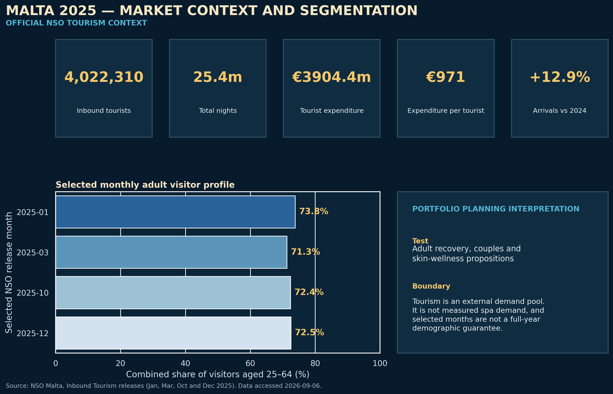

# Valletta Mediterranean Wellness Spa — thesis alignment

## Purpose and scope

This document reconciles the public portfolio with the final thesis narrative and the thesis-aligned financial workbook. It creates one auditable reference layer without rewriting the repository's mature multi-outlet demonstration.

Two scopes must remain separate:

| Scope | Purpose | Evidence status |
|---|---|---|
| Multi-outlet portfolio | Demonstrates governed KPI processing, management interpretation and action prioritisation | Author-generated synthetic/demo operating data |
| Valletta flagship thesis | Tests a proposed premium day-spa and boutique-hospitality wellness concept | Academic planning assumptions, official external context and formula-driven financial outputs |

No thesis forecast should be described as an operating actual, and no multi-outlet demo result should be presented as evidence that the Valletta flagship will achieve the thesis case.

## Market context and segmentation

Malta recorded 4,022,310 inbound tourists in 2025, 25.4 million nights and €3,904.4 million of tourist expenditure. Arrivals were 12.9% above 2024 and expenditure per capita was €971. The official annual figures are sourced from the National Statistics Office (NSO Malta), *Inbound Tourism: December 2025*, released 12 February 2026.

Selected NSO monthly releases show that visitors aged 25–44 and 45–64 together represented 73.8% in January, 71.3% in March, 72.4% in October and 72.5% in December 2025. This supports testing adult recovery, couples and skin-wellness propositions. It is not a full-year demographic distribution and must not be treated as proof of spa demand.

*Figure 2. Malta 2025 external tourism context and selected monthly adult visitor profile. Official NSO statistics are contextual evidence; the portfolio interpretation is a planning hypothesis, not measured Valletta spa demand.*

| External evidence | Planning implication | Limitation |
|---|---|---|
| Tourism arrivals | Test visitor partnerships and pre-arrival booking routes | Arrivals are not spa bookings |
| Tourist nights | Support hotel and city-break access planning | Length of stay does not prove purchase intention |
| Tourist expenditure | Provide broad affordability context | Trip expenditure is not a disposable spa budget |
| Monthly age profile | Test adult recovery, couples and skin-wellness propositions | Selected months are not a full-year demographic distribution |
| Seasonal proxy | Inform monthly staffing and promotion reviews | External context must not override POS and operating evidence |

The thesis base case assumes approximately 6,609 Year 1 treatment occasions. Under the internal 65% visitor-related and 35% resident/corporate planning mix, approximately 4,296 occasions are visitor-related. The resulting 0.107% comparison with 2025 inbound arrivals is an **arrival-capture proxy**, not market share: a visitor may book more than once, residents are also included in the plan, and official tourism arrivals do not measure spa purchase intent.

## Final Valletta flagship convention

| Area | Final convention |
|---|---:|
| Permanent employees | 15 employees |
| Permanent therapist capacity | 9 FTE |
| Relief therapist capacity | 593.33 budgeted hours in Year 1 |
| Facility operating days | 365 days/year |
| Opening hours | 12 hours/day, 09:00–21:00 |
| Paid hours | 45 hours/FTE/week |
| Non-bookable allowance | 22% of scheduled therapist-hours |
| Year 1 paid utilisation | 45% of net bookable therapist-hours |
| Treatment rooms | 6, including a flexible couples suite |
| VAT planning rate | 18% |
| Corporate income-tax planning rate | 35% |
| Property/hotel share | 15% of eligible net service revenue |
| Payment-processing fee | 2.2% of gross customer billings |
| Booking/channel fee | 3% of eligible gross channel billings |

The 45-hour roster is a planning convention, not permission to bypass employment rules, breaks, overtime premiums or applicable wage-regulation orders. Commercial launch requires current Maltese employment, payroll, tax and licensing review.

## Financial reconciliation

| Metric | Thesis-aligned result | Interpretation |
|---|---:|---|
| Opening investment | €350,000 | Includes €75,000 opening cash reserve |
| Year 1 net revenue | €1,151,000 | €1,010,000 service plus €141,000 ancillary revenue |
| Year 1 variable operating cost | €302,372 | 26.27% of net revenue |
| Year 1 fixed cash operating cost | €667,000 | Formula-linked category detail |
| Year 1 EBITDA | €181,628 | 15.8% margin |
| Year 1 profit after tax | €95,401 | Includes 35% planning current-tax charge |
| Break-even total net revenue | €904,657 | EBITDA break-even before depreciation, interest and tax |
| Break-even paid utilisation | 35.4% | Approximately 14.2 treatment occasions/day |
| NPV at 10% | €586,899 | Five-year project cash-flow basis |
| Project IRR | 50.9% | Sensitive to the assumed ramp and cash-flow pattern |
| Management-case payback | 2.81 years | Execution target, not a guarantee |
| Conservative-case payback | 3.36 years | Preferred range for investment discussion |
| Severe-case recovery | 5.70 years | Stress extension under demand and cost shock |
| Severe-case lowest operating cash | (€79,419) | Minimum additional liquidity before buffer and facility costs |

The arithmetic bridge is explicit:

`Year 1 EBITDA = €1,151,000 − €302,372.24 − €667,000 = €181,627.76`

`Break-even revenue = €667,000 ÷ 73.7296% = €904,656.95`

`Visitor arrival-capture proxy = (6,608.97 × 65%) ÷ 4,022,310 = 0.1068%`

## Source hierarchy and update rule

1. Official statistics govern external Malta tourism facts.
2. The final thesis-aligned workbook governs financial calculations and final operating conventions.
3. The integrated thesis governs narrative meaning, strategic boundaries and academic interpretation.
4. Synthetic multi-outlet files govern only the demonstration workflow in which they appear.

The row-by-row reconciliation is available in `data_processed/thesis_alignment/reconciliation_register.csv`. Evidence labels are governed by `docs/evidence_status_dictionary.md`.

If a source is revised, update the relevant CSV first, record the access and release dates, run `python scripts/qa/validate_thesis_alignment.py`, then update narrative text. Do not silently replace a thesis assumption with a demo value or infer spa demand from external tourism data.

## Primary references

- NSO Malta, *Inbound Tourism: December 2025*: https://nso.gov.mt/inbound-tourism-december-2025/
- NSO Malta, *Inbound Tourism: January 2025*: https://nso.gov.mt/wp-content/uploads/NR-047-2025.pdf
- NSO Malta, *Inbound Tourism: March 2025*: https://nso.gov.mt/wp-content/uploads/NR-078-2025.pdf
- NSO Malta, *Inbound Tourism: October 2025*: https://nso.gov.mt/wp-content/uploads/NR-223-2025_246.pdf
- Source integrated thesis: `Ana_Mardiana_Valletta_Spa_Complete_Thesis_Finance_Integrated_Final(3).docx`
- Repository-aligned thesis release: `Ana_Mardiana_Valletta_Spa_Complete_Thesis_Finance_Integrated_Repo_Aligned_Final.docx`
- Final supporting model: `Valletta_Mediterranean_Wellness_Spa_Financial_Model_Thesis_Aligned_Final.xlsx`

The controlled document names and SHA-256 hashes are recorded in `docs/controlled_document_register.csv`. The binary files are not duplicated in this repository.
